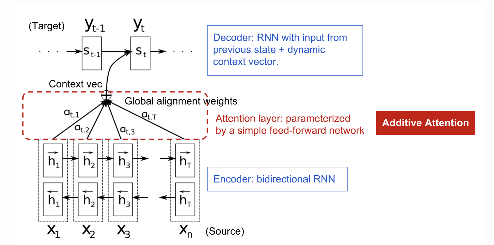

# Introduction

Here, we're going to review the concept of attention and attention-based models in DL. The material is mainly inspired by [this article](https://lilianweng.github.io/lil-log/2018/06/24/attention-attention.html).

Attention is, to some extent, motivated by how we pay visual attention to different regions of an image or correlate words in one sentence. In a nutshell, attention in the deep learning can be broadly interpreted as a vector of importance weights. In order to predict or infer one element, such as a pixel in an image or a world in a sentence, we estimate using the attention vector how strongly it is correlated with (or _"attends to"_ as you may have read in many papers) other elements and take the sum of their values weighted by the attention vector as the approximation of the target.

# What's wrong with Seq2Seq Model?
The **seq2seq** model aims to map some input sequence to an output sequence, both with arbitrary lengths. Applications include machine translation, question answering dialogue generation, etc. The seq2seq model normally has an encoder-decoder architecture. Both encoder and decoder are RNN models. 

A critical and apparent _**disadvantage**_ of seq2seq models is their incapability of remembering long sentences. The attention mechanism was born with [this paper](https://arxiv.org/pdf/1409.0473.pdf) in 2015 to resolve this problem.

The **attention mechanism** was born to help memorize long source sentences in _**Neural Machine Translation (NMT)**_. 

**Rather than building a single context vector out of the encoder's last hidden state, the _secret sauce_ invented by attention is  to create shortcuts between the context vector and the entire source input. The weights of these shortcut connections are customizable for each output element.**

While the context vector has access to the entire input sequence, we don’t need to worry about forgetting. The alignment between the source and target is learned and controlled by the context vector. Essentially the context vector consumes three pieces of information:

- encoder hidden states
- decoder hidden states
- alignment between source and target

# Definition
Assume we have a source sequence 
